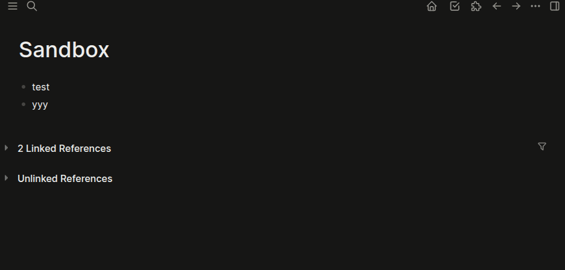

# 📄 Syncthink Conflicts Helper

**Automatically detect and summarize file conflicts caused by Syncthing.**

When using Logseq across multiple devices and Syncthing to synchronize files, it's common to run into synchronization conflicts — especially if the same page is edited before changes have synced. Syncthing will then generate duplicate “conflict files” which must be manually inspected and merged.

This plugin help solve that problem by automatically detecting conflicts and generating a clear, centralized summary page with a diff of all discrepancies.

## ✨ Features

* 🔍 Automatically scans for conflict files every 10 seconds
* 📝 Creates a Logseq page summarizing all detected conflicts
* 🧩 Displays differences in familiar `git diff` format
* 📚 Helps you quickly resolve and clean up conflicted pages
* ⚡ Lightweight and safe — does not modify your content directly

## 🛠 How It Works

1. The plugin periodically checks your graph for pages that Syncthing has marked as conflict copies.
2. When at least one conflict is found, the plugin icon changes to 🚨
3. Pressing the 🚨 icon generates a new Logseq page. This summary page includes:
   * A list of all conflict files
   * Git-style diffs showing what changed on each side
4. You review the differences and manually merge as needed.
5. If no conflits are found, the plugin icon shows ✅

This keeps your graph clean and ensures you never miss a sync conflict again.

## 📦 Installation

1. Open **Logseq** → **Plugins** → **Marketplace**
2. Search for "Syncthing Conflicts Helper"
3. Click Install
4. Pin your plugin so that you can see the status icon in the sidebar

## ⚙️ Configuration

| Setting            | Description                                        | Default                    |
|--------------------|----------------------------------------------------|----------------------------|
| Conflict Page Name | Name of the page where conflict reports are stored | Syncthing Conflicts Report |

## 🧪 Demo

## 🧑‍💻 Contributing

Pull requests and feature suggestions are welcome!
Please open an issue if you encounter a problem.

## 📄 License

MIT License
